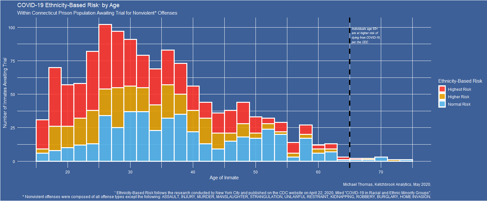

# Visualization of Connecticut's Incarcerated Pretrial Offenders Across COVID-19 Risk Groups 
This repository houses the data visualization and associated code showing the Connecticut state prison population of nonviolent offenders awaiting trial and their COVID-19 risk demography. 

The data around Connecticut individual incarceration statistics can be found here: [data.ct.gov](https://data.ct.gov/Public-Safety/Accused-Pre-Trial-Inmates-in-Correctional-Faciliti/b674-jy6w)

The ethnicity-based risk categories were defined using the guidance from the CDC found here: [COVID-19 in Racial and Ethnic Minority Groups
](https://www.cdc.gov/coronavirus/2019-ncov/need-extra-precautions/racial-ethnic-minorities.html)

The code that generated the visualization can be found [here](00_analysis.R), and the resulting visualization can be seen below:

